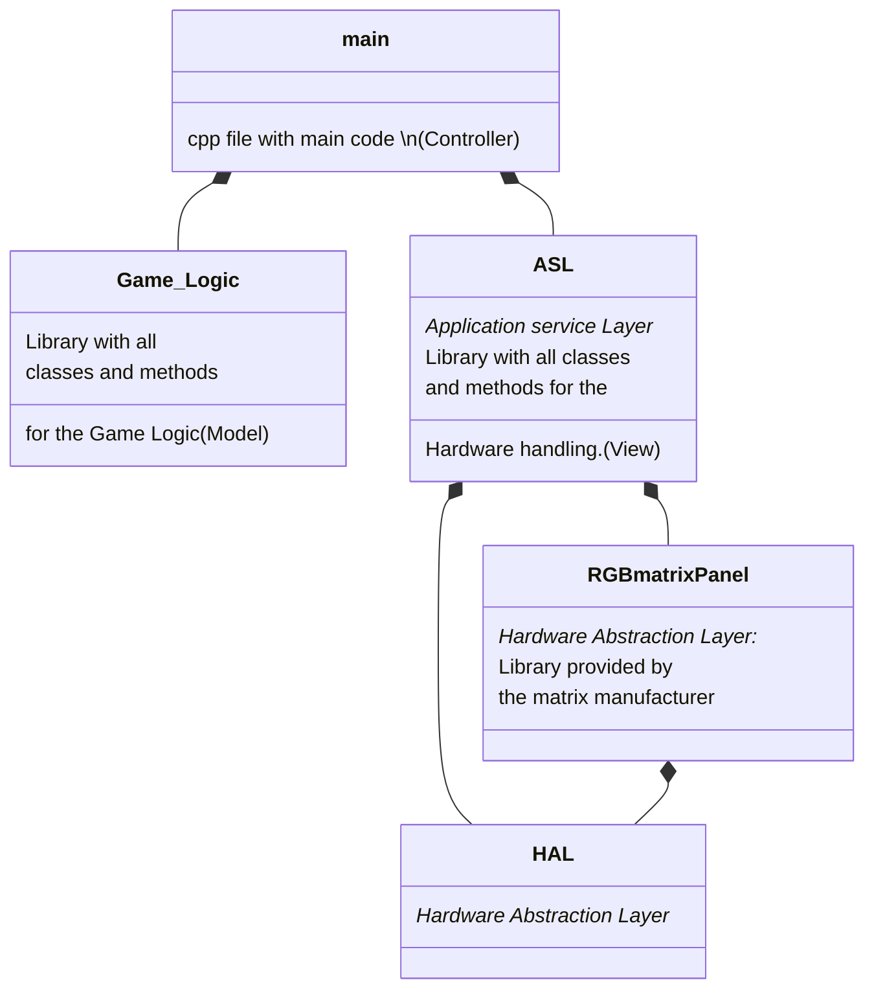
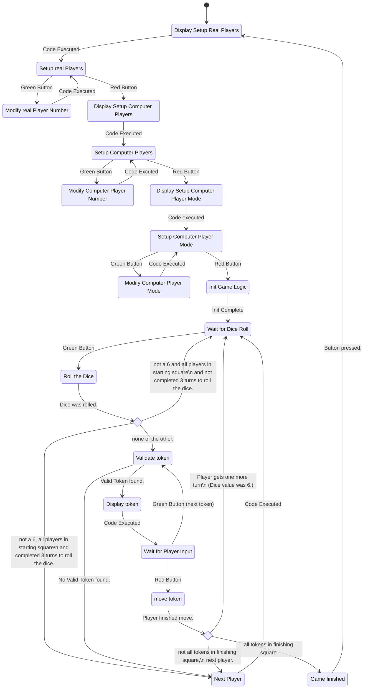
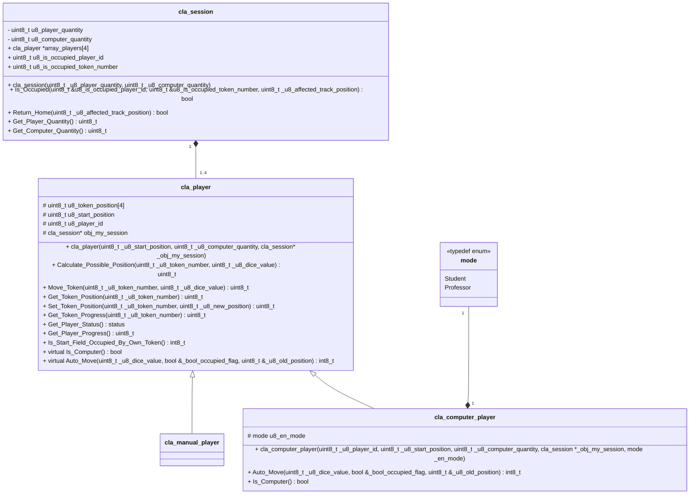
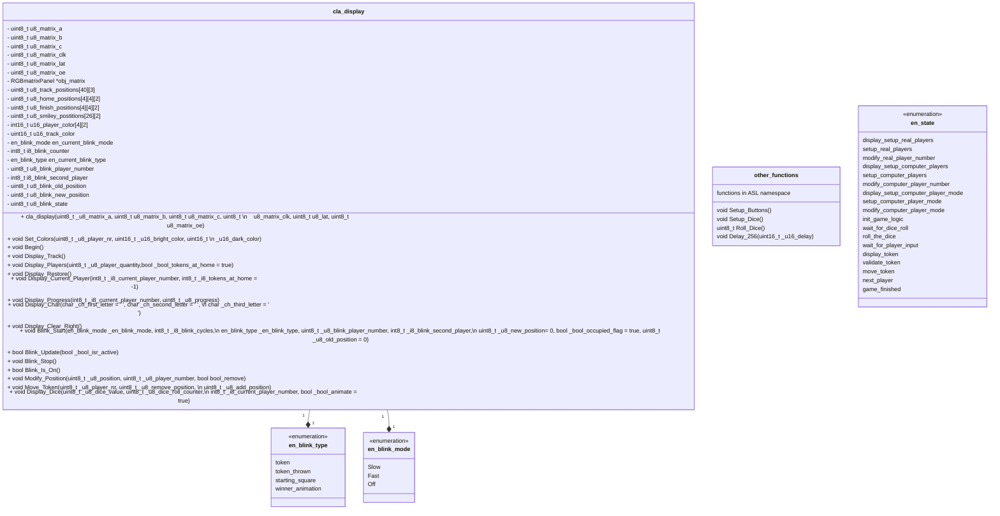

## Software Architecture



## Finite State Machine (with external memory)



## Game Logic Library

### Class Diagram

```cpp
note:   - : private
        # : protected
        + : public
```


### token_position and token_progress

```cpp
token_position
```
The absolute position of the token. The track squares are numbered the same for all players, so the starting track position for each player differs.
```cpp
token_progress
```
The relative Position of the token. The track squares are numbered individually for each player, so the starting track position for each player has the same number.

The following table shows all of the relative positions of the Players with the corresponding absolute position and Position name.

| position    | Player 1 | Player 2 | Player 3 | Player 4 | absolute position |
|---------|-----------|-----------|-----------|-----------|-------------------|
| starting square 1  | 1         | 1         | 1         | 1         | 1                 |
| starting square 2  | 2         | 2         | 2         | 2         | 2                 |
| starting square 3  | 3         | 3         | 3         | 3         | 3                 |
| starting square 4  | 4         | 4         | 4         | 4         | 4                 |
| track position 1  | 5         | 35        | 25        | 15        | 5                 |
| track position 2  | 6         | 36        | 26        | 16        | 6                 |
| track position 3  | 7         | 37        | 27        | 17        | 7                 |
| track position 4  | 8         | 38        | 28        | 18        | 8                 |
| track position 5  | 9         | 39        | 29        | 19        | 9                 |
| track position 6  | 10        | 40        | 30        | 20        | 10                |
| track position 7  | 11        | 41        | 31        | 21        | 11                |
| track position 8  | 12        | 42        | 32        | 22        | 12                |
| track position 9  | 13        | 43        | 33        | 23        | 13                |
| track position 10 | 14        | 44        | 34        | 24        | 14                |
| track position 11 | 15        | 5         | 35        | 25        | 15                |
| track position 12 | 16        | 6         | 36        | 26        | 16                |
| track position 13 | 17        | 7         | 37        | 27        | 17                |
| track position 14 | 18        | 8         | 38        | 28        | 18                |
| track position 15 | 19        | 9         | 39        | 29        | 19                |
| track position 16 | 20        | 10        | 40        | 30        | 20                |
| track position 17 | 21        | 11        | 41        | 31        | 21                |
| track position 18 | 22        | 12        | 42        | 32        | 22                |
| track position 19 | 23        | 13        | 43        | 33        | 23                |
| track position 20 | 24        | 14        | 44        | 34        | 24                |
| track position 21 | 25        | 15        | 5         | 35        | 25                |
| track position 22 | 26        | 16        | 6         | 36        | 26                |
| track position 23 | 27        | 17        | 7         | 37        | 27                |
| track position 24 | 28        | 18        | 8         | 38        | 28                |
| track position 25 | 29        | 19        | 9         | 39        | 29                |
| track position 26 | 30        | 20        | 10        | 40        | 30                |
| track position 27 | 31        | 21        | 11        | 41        | 31                |
| track position 28 | 32        | 22        | 12        | 42        | 32                |
| track position 29 | 33        | 23        | 13        | 43        | 33                |
| track position 30 | 34        | 24        | 14        | 44        | 34                |
| track position 31 | 35        | 25        | 15        | 5         | 35                |
| track position 32 | 36        | 26        | 16        | 6         | 36                |
| track position 33 | 37        | 27        | 17        | 7         | 37                |
| track position 34 | 38        | 28        | 18        | 8         | 38                |
| track position 35 | 39        | 29        | 19        | 9         | 39                |
| track position 36 | 40        | 30        | 20        | 10        | 40                |
| track position 37 | 41        | 31        | 21        | 11        | 41                |
| track position 38 | 42        | 32        | 22        | 12        | 42                |
| track position 39 | 43        | 33        | 23        | 13        | 43                |
| track position 40 | 44        | 34        | 24        | 14        | 44                |
| finishing square 1  | 45        | 45        | 45        | 45        | 45                |
| finishing square 2  | 46        | 46        | 46        | 46        | 46                |
| finishing square 3  | 47        | 47        | 47        | 47        | 47                |
| finishing square 4  | 48        | 48        | 48        | 48        | 48                |

The following image shows the absolute Track positions:


### Player Status

```cpp 
status Get_Player_Status() 
```

Returns the Players status. Status is defined via typedef enum and can have the following values:

en_status           |Token(s) in Starting Square| Token(s) on Game Track| Token(s) in Finishing Square
--------------------|---------------------------|-----------------------|---------------------------
Start               | YES                       | NO                    | NO
Start_Track         | YES                       | YES                   | NO
Start_Finished      | YES                       | NO                    | YES
Start_Track_Finished| YES                       | YES                   | YES
Error               | NO                        | NO                    | NO
Track               | NO                        | YES                   | NO
Finished            | NO                        | NO                    | YES
Track_Finished      | NO                        | YES                   | YES

## Class Diagram ASL



## Timers

The Game uses 5 of the 6 timers, which is one of the reasons an ATMega2560 was chosen over the ATMega328p:

- Timer 0: ( 8Bit) Runs from 0 to 5 to create a "random" Dice value
- Timer 1: (16Bit) Used for the LED matrix
- Timer 2: ( 8Bit) Reserved for future features, currently used for measuring interupt durations
- Timer 3: (16Bit) Used for Button Debounce
- Timer 4: (16Bit) Used for Led Blinking
- TImer 5: (16Bit) Used for Delay function.

Timer 0 is used to create a "random" dice value. The value is random, because no prescaler is used, so pressing the button at the right time to get a desired value is basically impossible. Therefore, the timer is set up in CTC mode without any interupts.

Timer 1 is used for refreshing the LED matrix. No prescaler is used for this timer and its value is read out at certain points in the function responsible for refreshing the matrix and the interval time for the refresh cycle is calculated together with other parameters.

Timer 2 is currently used for measuring the interupt time when using the TIMING_DEBUG_INTERN mode. Timer 2 is then set to no prescaler. It is set to 0 on Interupt start. The Timer value is read and written to an array on Interupt end.

Timer 3 is used for debouncing the Buttons. It will be started in the interupt routine for the Buttons. Prescaler is set to 1/1024. The debounce time can be varied using the ```DEBOUNCE_TIME``` define. 

Timer4 is used for Led Blinking. It will trigger an interupt at a given time interval. Time interval is given by the ```FAST_BLINK``` and ```SLOW_BLINK``` defines. The values for the defines were calculated using the DOC_ENG_CALC_Timer4_Blinking.xlsx Excel sheet.

<div style="background: #AFAFAF; padding: 5px">
<iframe width=100% height=600px frameborder="0" scrolling="no" src="https://onedrive.live.com/embed?resid=A555585E24922B9A%215354&authkey=%21AGnz5Cf017lT534&em=2&wdAllowInteractivity=False&wdHideHeaders=True&wdDownloadButton=True&wdInConfigurator=True&wdInConfigurator=True">
</iframe>
Excel Tabelle: DOC_ENG_CALC_Timer4_Blinking.xlsx
</div>
<br>

Timer5 is used for the ```Delay_256()``` functions. The Delay function differs from the blink function, because it will delay the program until the given time has passed. This is useful in some cases, because the program is NOT supposed to perform any Task until the Animation is finished.