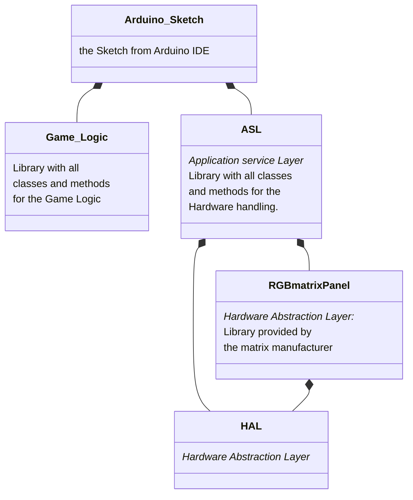
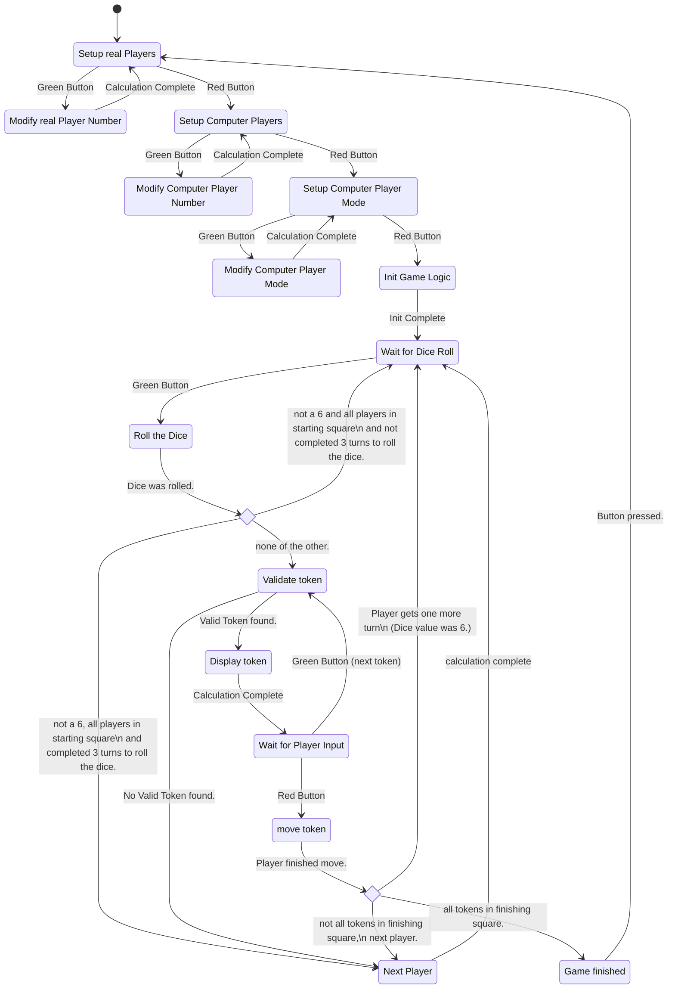
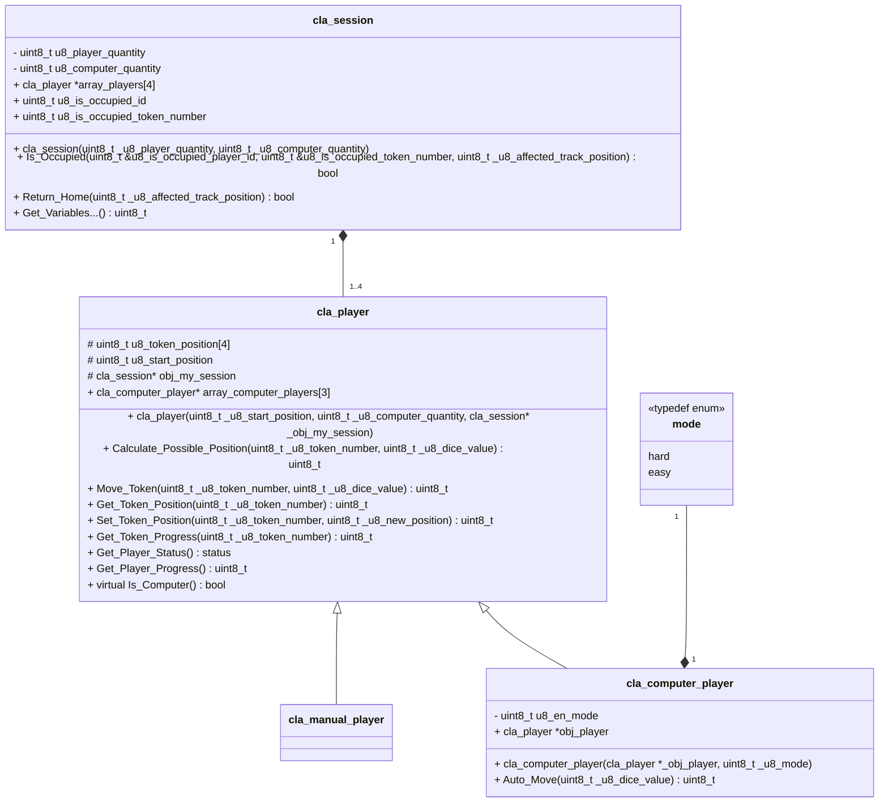
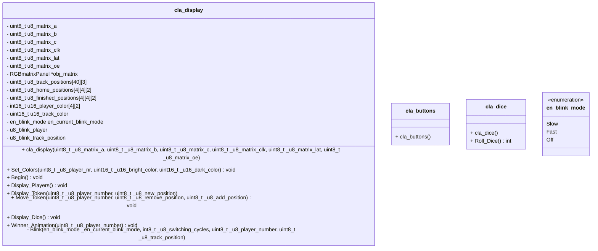

## Software Architecture



## Finite State Machine (with external memory)



## Class Diagram Game Logic Library

### Class Diagram

```cpp
note:   - : private
        # : protected
        + : public
```


### token_track_position and token_progress

```cpp
uint8_t u8_token_track_position
```
The absolute position of the token. The track squares are numbered the same for all players, so the starting square for each player differs.
```cpp
uint8_t u8_token_progress
```
The relative Position of the token. The track squares are numbered individually for each player, so the starting square for each player has the same number.

### Functional Description of Methods

#### cla_session

```cpp
cla_session(uint8_t _u8_player_quantity, uint8_t _u8_computer_quantity)
```
Constructor.


```cpp
Is_Occupied(uint8_t _u8_affected_track_position) : uint8_t
```
checks if there is a token at a given track position


```cpp
Return_Home(uint8_t _u8_affected_track_position) : bool
```
checks if there is a token at a given track position and puts it back into the starting square. If a token was returned, the return value is ```True```. If the track position was not occupied, the return value is ```False```


#### cla_player

```cpp
cla_player(uint8_t _u8_start_position, uint8_t _u8_computer_quantity,cla_session* _obj_my_session)
```
Constructor. A pointer to the corresponding session class is needed for calling cla_session methods calling inside cla_player methods.

```cpp
uint8_t Calculate_Possible_Position(uint8_t _u8_token_number, uint8_t _u8_dice_value) 
```
Return the position that can be reached with the dice value. (absolut position (absolute Positions are 5-44))

```cpp
uint8_t Move_Token(uint8_t _u8_token_number, uint8_t _u8_dice_value)
```
Moves the Token and returns the reached position. (absolute position)

```cpp
uint8_t Get_Token_Position(uint8_t _u8_token_number)
```
Returns the absolute Position of the Token (track position)

```cpp
uint8_t Get_Token_Progress(uint8_t _u8_token_number)
```
Returns the relative Position (1-39) of the Token (progress)

```cpp 
status Get_Player_Status() 
```
Returns the Players status. Status is defined via typedef enum and can have the following values:
en_status           |Token(s) in Starting Square| Token(s) on Game Track| Token(s) in Finishing Square
--------------------|---------------------------|-----------------------|---------------------------
Start               | YES                       | NO                    | NO
Start_Track         | YES                       | YES                   | NO
Start_Finished      | YES                       | NO                    | YES
Start_Track_Finished| YES                       | YES                   | YES
Error               | NO                        | NO                    | NO
Track               | NO                        | YES                   | NO
Finished            | NO                        | NO                    | YES
Track_Finished      | NO                        | YES                   | YES

```cpp
uint8_t Get_Player_Progress()
```
Adds the u8_token_progress of all tokens together and returns that value (Finished == 166).

```cpp
virtual bool Is_Computer()
```
Returns ```True``` or ```False```. Method implemented individually in child classes. If possible, an alternative would be to actually return the type. the method name would then be something like ```Get_Player_Type()```

#### cla_computer_player

```cpp
uint8_t Auto_Move(uint8_t _u8_dice_value)
```
Calculates a move automatically depending on en_mode.

### Example code snippets

```cpp
cla_session::cla_session(uint8_t _u8_player_quantity, uint8_t _u8_computer_quantity){
    uint8_t i = 0;
    while(i < (_u8_player_quantity - _u8_computer_quantity)){
        obj_player[i] = new cla_manual_player();
        i++;
    }
    while(i < _u8_player_quantity){
        obj_player[i] = new cla_computer_player();
        i++;
    }
}
//  u8_player_quantity 
//      = cu8_computer_quantity + quantity of manual players.
```
With this setup, computers are always the last at play. Maybe a different approach is better for the Game experience.

AutoMove() might need two return parameters. This could be done like this:
```cpp
    #include <utility>
    return std::make_pair(intValue, doubleValue);
```

## Class Diagram ASL



#### Timers

- Timer 0: ( 8Bit) Runs from 0 to 5 to create a "random" Dice value
- Timer 1: (16Bit) Used for the LED matrix
- Timer 2: ( 8Bit) Not in Use
- Timer 3: (16Bit) Used for Button Debounce
- Timer 4: (16Bit) Used for Led Blinking
- TImer 5: (16Bit) Not in Use