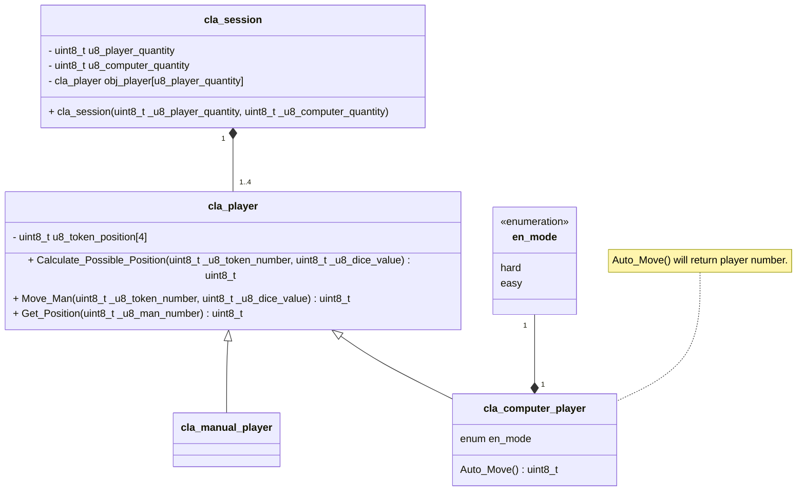

## Zustandsautomat


## Klassendiagramm Spiellogik

#### Klassendiagramm

#### Beispiel
```cpp
cla_session::cla_session(uint8_t _u8_player_quantity, uint8_t _u8_computer_quantity){
    uint8_t i = 0;
    while(i < (_u8_player_quantity - _u8_computer_quantity)){
        obj_player[i] = new cla_manual_player();
        i++;
    }
    while(i < _u8_player_quantity){
        obj_player[i] = new cla_computer_player();
        i++;
    }
}
//  u8_player_quantity 
//      = cu8_computer_quantity + quantity of manual players.
```
Eventuell könnte hierbei eine Abfrage, ob der Spieler manuell oder Computer ist, zum Problem werden.
Computer wären bei dieser Anordnung immer als letztes am Zug.


