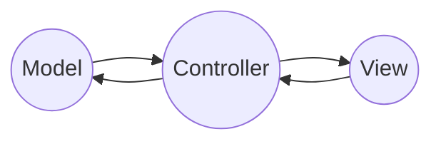

# Systemarchitektur:
Der grundlegende Gedanke unser Projekt aufzubauen war der, dass wir die Spielelogik und das Anzeigen auf der LED-Matrix jeweils in einer Bibliothek implementieren. Dadurch kam für uns das MVC-Modell für unsere Systemarchitektur infrage. 

### Modell View Controller:
- 1 - Modell (Model):
Die Bibliothek für die Spielelogik stellt das "Modell" dar. Sie enthält die grundlegenden Regeln und Abläufe des Spiels, wie die Spiellogik, Spielzustände, Spielerpositionen usw.

- 2 - Ansicht (View):
Die Bibliothek für die Anzeige auf der LED-Matrix stellt die "Ansicht" dar. Sie ist verantwortlich für die Darstellung des aktuelle Phase des Spiels auf der Benutzeroberfläche (in diesem Fall auf der LED-Matrix). Sie kümmert sich um die visuelle Darstellung des Spielbretts, Spielerfiguren und anderer Spielinformationen.

- 3 - Controller:
Die main.cpp ist der "Controller". Er handelt die Benutzereingaben ab, koordiniert die Interaktion zwischen Modell und Ansicht und aktualisiert den Spielzustand entsprechend. Der Controller entscheidet, welche Aktionen basierend auf Benutzereingaben oder dem aktuellen Zustand des Spiels ausgeführt werden sollen, und ruft entsprechende Funktionen im Modell auf, um den Zustand des Spiels zu ändern. Er kann auch die Ansicht aktualisieren, um Änderungen im Spielzustand widerzuspiegeln.

In diesem Sinne ähnelt undere Systemarchitektur dem MVC-Muster, wobei die Spielelogik das Modell darstellt, die Bibliothek für die Anzeige die Ansicht und die main.cpp den Controller. Dadurch bietet das MVC-Muster eine nützliche Struktur, um die Verantwortlichkeiten der Komponenten zu organisieren.

