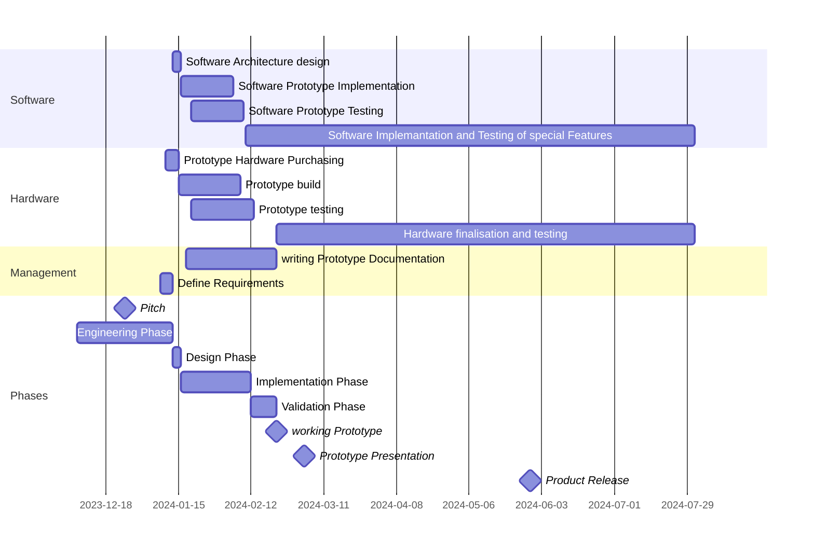

## Schedule

```mermaid
gantt
    tickInterval 4week
    weekday monday
    dateFormat YYYY-MM-DD
    section Software
        Software Architecture design        :a1, 2024-01-13, 3d
        Software Prototype Implementation   :a2, after a1, 20d
        Software Prototype Testing          :a3, 2024-01-20, 20d
        Software Implemantation and Testing of special Features :2024-02-10, 2024-08-01
    section Hardware
        Prototype Hardware Purchasing       :b1, 2024-01-10, 5d
        Prototype build                     :after b1, 24d
        Prototype testing                   :2024-01-20, 24d
        Hardware finalisation and testing   :2024-02-22, 2024-08-01
    section Management
        writing Prototype Documentation     :c1, 2024-01-18, 2024-02-22
        Define Requirements                 :c2, 2024-01-08, 2024-01-13
    section Phases
        Pitch                               :milestone, 2023-12-07
        Engineering Phase                   :d1, 2023-12-07, 2024-01-13
        Design Phase                        :d2, after d1, 3d
        Implementation Phase                :d3, after d2, 2024-02-12
        Validation Phase                    :d4, after d3, 2024-02-22
        working Prototype                   :milestone, 2024-02-22 
        Prototype Presentation              :milestone, 2024-03-14
        Product Release                     :milestone, 2024-08-14
```