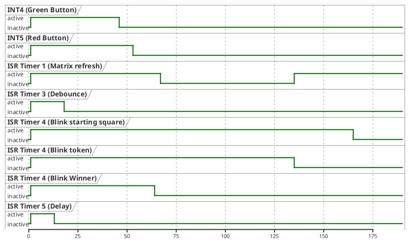
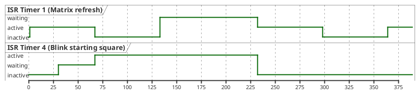

# Interupt Analyse

Um einen reibungsfreien Programmablauf sicherzustellen, wurde die Dauer aller Interupts gemessen. Darüber hinaus wurde bei durch Timernutzung automatisch wiederholten Interupts die Frequenz aufgezeichnet. Dabei wurden die Taktzyklen gemessen. Anschließend wurde ein Mittelwert ermittelt und daraus die Zeit in Mikrosekunden berechnet. Ebenfalls wurde der Extremfall des Maximalwertes betrachtet, da dieser Wert für den Ablauf des Programms kritisch werden kann.

<iframe width=100% height=300px frameborder="0" scrolling="no" src="https://onedrive.live.com/embed?resid=A555585E24922B9A%215379&authkey=%21AAHF0hk_109KpvE&em=2&wdAllowInteractivity=False&wdHideHeaders=True&wdDownloadButton=True&wdInConfigurator=True&wdInConfigurator=True"></iframe>
Excel Tabelle: DOC_ENG_TA_Interupt_Messungen.xlsx

Dabei lässt sich festhalten, dass keiner der Werte krtisch groß wird. Der längste Interupt liegt bei 10,31 us, was bei einer Interupt-frequenz von 8 Hz (Taktdauer 0,125 s) 0,0082 % der Taktdauer entspricht.

In der folgenden Grafik ist die benötigte Zeitdauer der verschiedenen Interupts dargestellt. Dabei wurde ausschließlich beim ISR des Timer 1 (Matrix refresh) die Wiederholung des Interupts eingezeichnet, da bei allen anderen Interupts die Wiederholung eine Skalierung der Zeitachse benötigen würde, bei der die eigentliche Dauer der Interupts nicht mehr erkennbar wäre.

Selbstverständlich werden die Interuptroutinen auf dem ATMega2560 nicht gleichzeitig ausgeführt. Dabei unterbricht ein während einer anderen Interuptserviceroutine eintreffender Interupt die laufende Interuptserviceroutine nicht, sondern wird direkt im Anschluss ausgeführt. Entsprechend tritt auch kein Problem bei der Kombination des Matrix-Refresh Interupts mit dem Interupt des Timers 4, welcher für das Blinken des Hauses zuständig ist, auf. Der Matrix Interupt wird einfach im Anschluss ausgeführt, wobei der Jitter des Interupts  für den Benutzer nicht erkennbar ist. Dieser Fall ist in der nächsten Abbildung genauer betrachtet.

